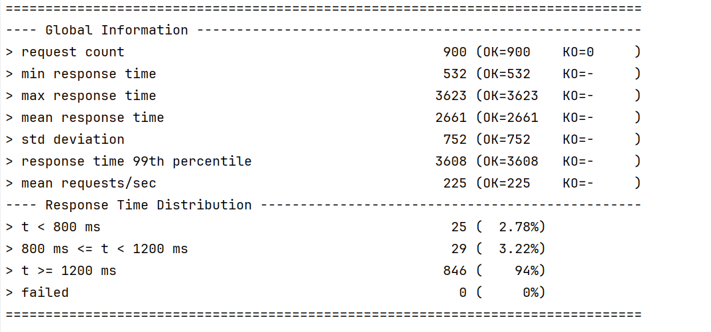

# Micro WebPoS

## 系统介绍
1. 实现了4个微服务：用户管理服务、商品管理服务、购物车管理服务、订单管理服务；
2. 实现了 discovery、gateway 等微服务架构下需要的基础设施服务；
3. 可以通过 gateway 访问4个服务，分别通过:   
   http://localhost:8080/api/user
   http://localhost:8080/api/product
   http://localhost:8080/api/cart
   http://localhost:8080/api/order
4. 使用了`RestTemplate`进行服务间访问；
5. 在 geteway 中查看某个用户的购物车时使用了断路器，先访问用户管理服务，在访问购物车管理服务，若接收到错误信息，使用断路器，返回一个空的购物车；

## 实验进行
1. 验证Client-side LB可行：
   * 首先开启两个用户管理服务：
   * 然后访问 http://localhost:8080/api/user/users ，得到信息：
   * 再次访问 http://localhost:8080/api/user/users ，得到信息：
   * 这两个信息分别于两个用户管理服务的实例发出，可以验证Client-side LB可行
2. 压力测试实验验证对单个微服务进行水平扩展（而无需整个系统所有服务都进行水平扩展）可以提升系统性能：
   * 实验中仅开启用户管理服务和商品管理服务（不然电脑负载太大）
   * 首先只开启各一个服务：
   * 运行压力测试，注入300个用户查询用户信息，600个用户查询商品信息，得到输出：
   * 然后开启第二个用户管理服务：
   * 再次运行压力测试，得到输出：
   * 然后关闭第二个用户管理服务，并开启第二个商品管理服务：
   * 再次运行压力测试，得到输出：
   * 发现对单个微服务进行水平扩展（而无需整个系统所有服务都进行水平扩展）可以提升系统性能，并且由于压力测试中商品查询的次数更多，所以商品管理服务水平扩展的效果更好。